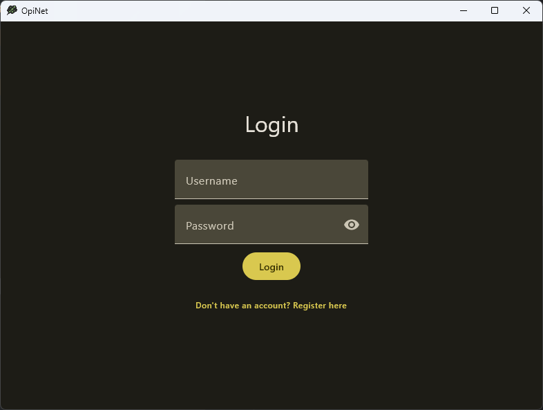
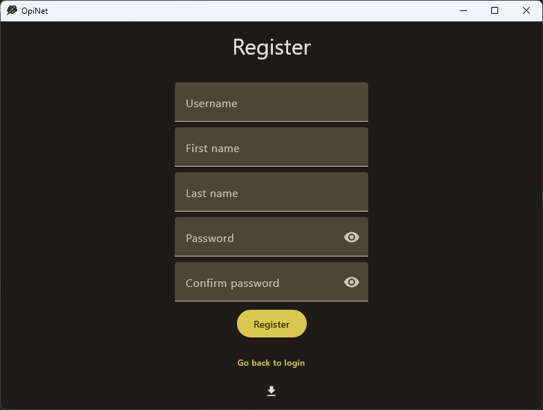
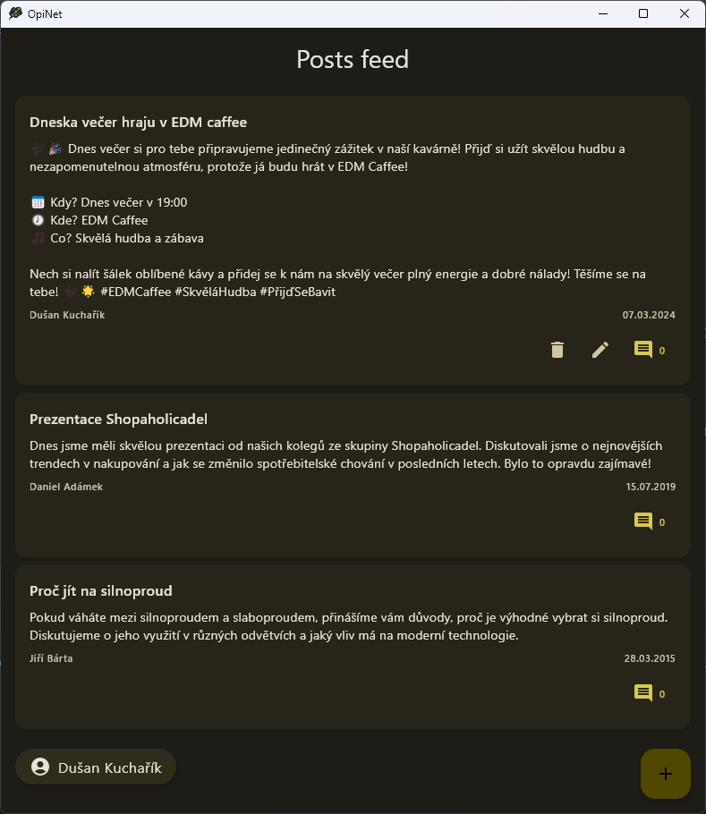
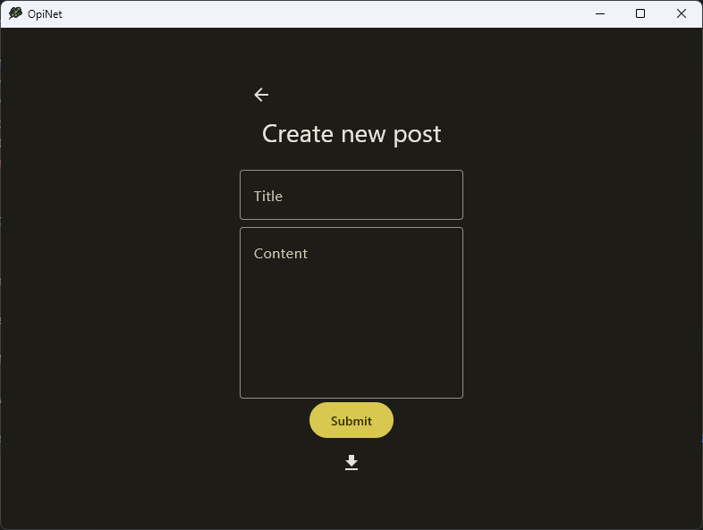

**This project was made as a school assignment and has no real purpose!**

# OpiNet

OpiNet is an imaginary social media platform, where anyone can create an account and then upload posts and comment posts
of other people.

This project has no purpose as it directly interacts with the database, which makes no sense. Not for use!

## Screenshots

## Importing

### Users

1. Open `opinet.conf` and configure your CSV delimiter in the `import` section.
2. Go to registration and click the import button at the bottom.
3. Select your CSV file.
4. The columns are in the following order: `username`, `first name`, `last name`, `password`
5. Check the console for any possible errors.

### Posts

1. Open `opinet.conf` and in the `import` section.
   1. Configure your CSV delimiter.
   2. Configure your date format.
2. Login with any account and go to create new post page.
3. Click the import button at the bottom.
4. Select your CSV file.
5. The columns are in the following order: `author username`, `upload date`, `title`, `content`
6. Check the console for any possible errors.
